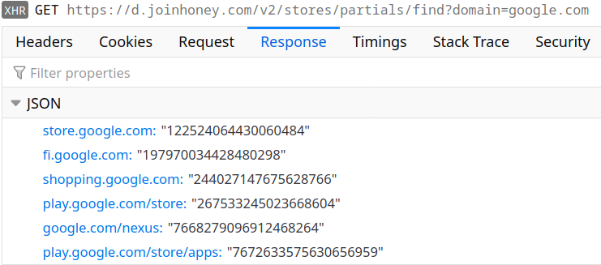
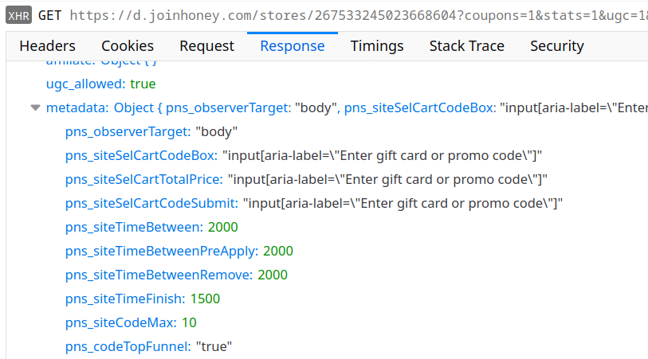
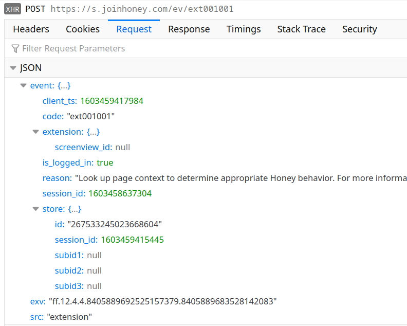
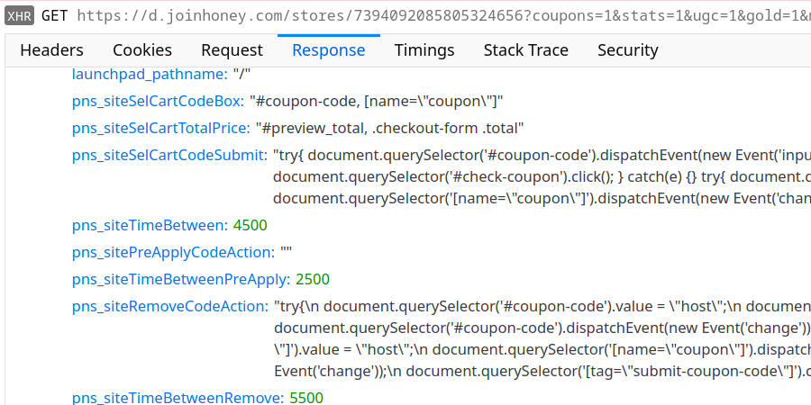
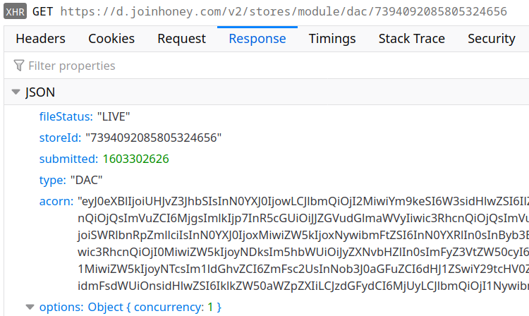
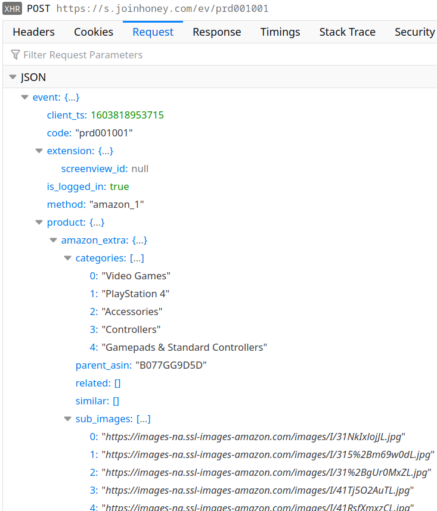

Honey is a popular browser extension built by the PayPal subsidiary Honey Science LLC. It promises nothing less than preventing you from wasting money on your online purchases. Whenever possible, it will automatically apply promo codes to your shopping cart, thus saving your money without you lifting a finger. And it even runs a reward program that will give you some money back! Sounds great, what’s the catch?

With such offers, the price you pay is usually your privacy. With Honey, it’s also security. The browser extension is highly reliant on instructions it receives from its server. I found at least four ways for this server to run arbitrary code on any website you visit. So the extension can mutate into spyware or malware at any time, for all users or only for a subset of them – without leaving any traces of the attack like a malicious extension release.


<em>
  Image credits:
  <a href="https://www.joinhoney.com/" rel="nofollow">Honey</a>,
  <a href="https://opengameart.org/content/glitch-food-drink-items-svg" rel="nofollow">Glitch</a>,
  <a href="https://openclipart.org/detail/279797/fly-5" rel="nofollow">Firkin</a>,
  <a href="https://openclipart.org/detail/303327/fly-and-swatter" rel="nofollow">j4p4n</a>
</em>




## The trouble with shopping assistants

Please note that there are objective reasons why it’s really hard to build a good shopping assistant. The main issue is how many online shops there are. Honey supports close to 50 thousand shops, yet I easily found a bunch of shops that were missing. Even the shops based on the same engine are typically customized and might have subtle differences in their behavior. Not just that, they will also change without an advance warning. Supporting this zoo is far from trivial.

Add to this the fact that with most of these shops there is very little money to be earned. A shopping assistant needs to work well with Amazon and Shopify. But supporting everything else has to come at close to no cost whatsoever.

The resulting design choices are the perfect recipe for a privacy nightmare:

* As much server-side configuration as somehow possible, to avoid releasing new extension versions unnecessarily
* As much data extraction as somehow possible, to avoid manual monitoring of shop changes
* Bad code quality with many inconsistent approaches, because improving code is costly

I looked into Honey primarily due to its popularity, it being used by more than 17 million users according to the statement on the product’s website. Given the above, I didn’t expect great privacy choices. And while I haven’t seen anything indicating malice, the poor choices made still managed to exceed my expectations by far.

## Unique user identifiers

By now you are probably used to reading statements like the following in [company’s privacy statements](https://www.joinhoney.com/data-and-privacy):

> None of the information that we collect from these events contains any personally identifiable information (PII) such as names or email addresses.

But of course a persistent semi-random user identifier doesn’t count as “personally identifiable information.” So Honey creates several of those and sends them with every request to its servers:



Here you see the `exv` value in the `Cookie` header: it is a combination of the extension version, a user ID (bound to the Honey account if any) and a device ID (locally generated random value, stored persistently in the extension data). The same value is also sent with the payload of various requests.

If you are logged into your Honey account, there will also be `x-honey-auth-at` and `x-honey-auth-rt` headers. These are an access and a refresh token respectively. It’s not that these are required (the server will produce the same responses regardless) but they once again associate your requests with your Honey account.

So that’s where this Honey privacy statement is clearly wrong: while the data collected doesn’t contain your email address, Honey makes sure to associate it with your account among other things. And the account is tied to your email address. If you were careless enough to enter your name, there will be a name associated with the data as well.

## Remote configure everything

Out of the box, the extension won’t know what to do. Before it can do anything at all, it first needs to ask the server which domains it is supposed to be active on. The result is currently a huge list with some of the most popular domains like google.com, bing.com or microsoft.com listed.

Clearly, not all of google.com is an online shop. So when you visit one of the “supported” domains for the first time within a browsing session, the extension will request additional information:

Now the extension knows to ignore all of google.com but the shops listed here. It still doesn’t know anything about the shops however, so when you visit Google Play for example there will be one more request:

The `metadata` part of the response is most interesting as it determines much of the extension’s behavior on the respective website. For example, there are optional fields `pns_siteSelSubId1` to `pns_siteSelSubId3` that determine what information the extension sends back to the server later:

Here the field `subid1` and similar are empty because `pns_siteSelSubId1` is missing in the store configuration. Were it present, Honey would use it as a CSS selector to find a page element, extract its text and send that text back to the server. Good if somebody wants to know what exactly people are looking at.

Mind you, I only found this functionality enabled on amazon.com and macys.com, yet the selectors provided appear to be outdated and do not match anything. So is this some outdated functionality that is no longer in use and that nobody bothered removing yet? Very likely. Yet it could jump to life any time to collect more detailed information about your browsing habits.

## The highly flexible promo code applying process

As you can imagine, the process of applying promo codes can vary wildly between different shops. Yet Honey needs to do it somehow without bothering the user. So while store configuration normally tends to stick to CSS selectors, for this task it will resort to JavaScript code. For example, you get the following configuration for hostgator.com:

The JavaScript code listed under `pns_siteRemoveCodeAction` or `pns_siteSelCartCodeSubmit` will be injected into the web page, so it could do anything there: add more items to the cart, change the shipping address or steal your credit card data. Honey requires us to put lots of trust into their web server, isn’t there a better way?

Turns out, Honey actually found one. Allow me to introduce a mechanism labeled as “DAC” internally for reasons I wasn’t yet able to understand:

The `acorn` field here contains base64-encoded JSON data. It’s the output of the [acorn JavaScript parser](https://www.npmjs.com/package/acorn): an Abstract Syntax Tree (AST) of some JavaScript code. When reassembled, it turns into this script:


let price = state.startPrice;
try {
    $('#coupon-code').val(code);
    $('#check-coupon').click();
    setTimeout(3000);
    price = $('#preview_total').text();
} catch (_) {
}
resolve({ price });


But Honey doesn’t reassemble the script. Instead, it runs it via a [JavaScript-based JavaScript interpreter](https://neil.fraser.name/software/JS-Interpreter/docs.html). This library is explicitly meant to run untrusted code in a sandboxed environment. All one has to do is making sure that the script only gets access to safe functionality.

But you are wondering what this `$()` function is, aren’t you? It almost looks like jQuery, a library that I called out as a security hazard on [multiple](/2015/08/30/why-you-probably-want-to-disable-jqueryparsehtml-even-though-you-don-t-call-it/) [occasions](/2020/03/02/psa-jquery-is-bad-for-the-security-of-your-project/). And indeed: Honey chose to expose full jQuery functionality to the sandboxed scripts, thus rendering the sandbox completely useless.

Why did they even bother with this complicated approach? Beats me. I can only imagine that they had trouble with shops using [Content Security Policy (CSP)](https://developer.mozilla.org/en-US/docs/Web/HTTP/CSP) in a way that prohibited execution of arbitrary scripts. So they decided to run the scripts outside the browser where CSP couldn’t stop them.

## When selectors aren’t actually selectors

So if the Honey server turned malicious, it would have to enable Honey functionality on the target website, then trick the user into clicking the button to apply promo codes? It could even make that attack more likely to succeed because some of the CSS code styling the button is conveniently served remotely, so the button could be made transparent and spanning the entire page – the user would be bound to click it.

No, that’s still too complicated. Those selectors in the store configuration, what do you think: how are these turned into actual elements? Are you saying `document.querySelector()`? No, guess again. Is anybody saying “jQuery”? Yes, of course it is using jQuery for extension code as well! And that means that [every selector could be potentially booby-trapped](/2015/08/30/why-you-probably-want-to-disable-jqueryparsehtml-even-though-you-don-t-call-it/).

In the store configuration pictured above, `pns_siteSelCartCodeBox` field has the selector `#coupon-code, [name="coupon"]` as its value. What if the server replaces the selector by ``? Exactly, this will happen:



This message actually appears multiple times because Honey will evaluate this selector a number of times for each page. It does that for any page of a supported store, unconditionally. Remember that whether a site is a supported store or not is determined by the Honey server. So this is a very simple and reliable way for this server to leverage its privileged access to the Honey extension and run arbitrary code on any website ([Universal XSS vulnerability](https://en.wikipedia.org/wiki/Cross-site_scripting#Related_vulnerabilities)).

## How about some obfuscation?

Now we have simple and reliable, but isn’t it also too obvious? What if somebody monitors the extension’s network requests? Won’t they notice the odd JavaScript code?

That scenario is rather unlikely actually, e.g. if you look at how long [Avast has been spying on their users](/2019/10/28/avast-online-security-and-avast-secure-browser-are-spying-on-you/) with barely anybody noticing. But Honey developers are always up to a challenge. And their solution was aptly named “VIM” (no, they definitely don’t mean the editor). Here is one of the requests downloading VIM code for a store:



This time, there is no point decoding the base64-encoded data: the result will be binary garbage. As it turns out, the data here has been encrypted using AES, with the start of the string serving as the key. But even after decrypting you won’t be any wiser: the resulting JSON data has all key names replaced by numeric indices and values are once again encrypted.

You need the following script to decrypt the data (requires [CryptoJS](https://cryptojs.gitbook.io/docs/)):


const keys = [
  "alternate", "argument", "arguments", "block", "body", "callee", "cases",
  "computed", "consequent", "constructor", "declaration", "declarations",
  "discriminant", "elements", "expression", "expressions", "finalizer",
  "handler", "id", "init", "key", "kind", "label", "left", "method", "name",
  "object", "operator", "param", "params", "prefix", "properties", "property",
  "quasi", "right", "shorthand", "source", "specifiers", "superClass", "tag",
  "test", "type", "update", "value"
];

function decryptValue(obj)
{
  if (Array.isArray(obj))
    return obj.map(decryptValue);
  if (typeof obj != "object" || !obj)
    return obj;

  let result = {};
  for (let key of Object.keys(obj))
  {
    let value = obj[key];
    if (key.startsWith("_"))
      key = keys[parseInt(key.substr(1), 10)];
    if (typeof value == "string")
      value = CryptoJS.AES.decrypt(value.slice(1), value[0] + "+" + key).toString(CryptoJS.enc.Utf8);
    else
      value = decryptValue(value);
    result[key] = value;
  }
  return result;
}

var data = "<base64 string here>";
data = JSON.parse(CryptoJS.AES.decrypt(data.slice(10), data.slice(0, 10)).toString(CryptoJS.enc.Utf8));
console.log(decryptValue(data));


What you get is once again the Abstract Syntax Tree (AST) of some JavaScript code. The lengthy chunks of JavaScript code are for example categorizing the pages of a shop, determining what kind of logic should apply to these. And the sandboxing is once again ineffective, with the code being provided access to jQuery for example.

So here is a mechanism, providing the server with a simple way to run arbitrary JavaScript code on any website it likes, immediately after the page loads and with sufficient obfuscation that nobody will notice anything odd. Mission accomplished?

## Taking over the extension

Almost. So far we were talking about running code in the context of websites. But wouldn’t running code in the context of the extension provide more flexibility? There is a small complication: [Content Security Policy (CSP) mechanism](https://developer.mozilla.org/en-US/docs/Web/HTTP/CSP) disallows running arbitrary JavaScript code in the extension context. At least that’s the case with the Firefox extension due to the Mozilla Add-ons requirements, on Chrome the extension simply relaxed CSP protection.

But that’s not really a problem of course. As we’ve already established, running the code in your own JavaScript interpreter circumvents this protection. And so the Honey extension also has VIM code that will run in the context of the extension’s background page:



It seems that the purpose of this code is extracting user identifiers from various advertising cookies. Here is an excerpt:


var cs = {
    CONTID: {
        name: 'CONTID',
        url: 'https://www.cj.com',
        exVal: null
    },
    s_vi: {
        name: 's_vi',
        url: 'https://www.linkshare.com',
        exVal: null
    },
    _ga: {
        name: '_ga',
        url: 'https://www.rakutenadvertising.com',
        exVal: null
    },
    ...
};


The extension conveniently grants this code access to all cookies on any domains. This is only the case on Chrome however, on Firefox the extension doesn’t request access to cookies. That’s most likely to address concerns that Mozilla Add-ons reviewers had.

The script also has access to jQuery. With the relaxed CSP protection of the Chrome version, this allows it to load any script from paypal.com and some other domains at will. These scripts will be able to do anything that the extension can do: read or change website cookies, track the user’s browsing in arbitrary ways, inject code into websites or even modify server responses.

On Firefox the fallout is more limited. So far I could only think of one rather exotic possibility: add a frame to the extension’s background page. This would allow loading an arbitrary web page that would stay around for the duration of the browsing session while being invisible. This attack could be used for [cryptojacking](https://www.malwarebytes.com/cryptojacking/) for example.

## About that privacy commitment…

The [Honey Privacy and Security policy](https://www.joinhoney.com/privacy) states:

> We will be transparent with what data we collect and how we use it to save you time and money, and you can decide if you’re good with that.

This sounds pretty good. But if I still have you here, I want to take a brief look at what this means in practice.

As the privacy policy explains, Honey collects information on availability and prices of items with your help. Opening a single Amazon product page results in numerous requests like the following:

{{}}

The code responsible for the data sent here is only partly contained in the extension, much of it is loaded from the server:



Yes, this is yet another block of obfuscated VIM code. That’s definitely an unusual way to ensure transparency…

On the bright side, this particular part of Honey functionality can be disabled. That is, if you find the “off” switch. Rather counter-intuitively, this setting is part of your account settings on the Honey website:



Don’t know about you, but after reading this description I would be no wiser. And if you don’t have a Honey account, it seems that there is no way for you to disable this. Either way, from what I can tell this setting won’t affect other tracking like `pns_siteSelSubId1` functionality outlined above.

On a side note, I couldn’t fail to notice one more interesting feature not mentioned in the privacy policy. Honey tracks ad blocker usage, and it will even re-run certain tracking requests from the extension if blocked by an ad blocker. So much for your privacy choices.

## Why you should care

In the end, I found that the Honey browser extension gives its server very far reaching privileges, but I did not find any evidence of these privileges being misused. So is it all fine and nothing to worry about? Unfortunately, it’s not that easy.

While the browser extension’s codebase is massive and I certainly didn’t see all of it, it’s possible to make definitive statements about the extension’s behavior. Unfortunately, the same isn’t true for a web server that one can only observe from outside. The fact that I only saw non-malicious responses doesn’t mean that it will stay the same way in future or that other people will make the same experience.

In fact, if the server were to invade users’ privacy or do something outright malicious, it would likely try to avoid detection. One common way is to only do it for accounts that accumulated a certain amount of history. As security researchers like me usually use fairly new accounts, they won’t notice anything. Also, the server might decide to limit such functionality to countries where litigation is less likely. So somebody like me living in Europe with its strict privacy laws won’t see anything, whereas US citizens would have all of their data extracted.

But let’s say that we really trust Honey Science LLC given its great track record. We even trust PayPal who happened to acquire Honey this year. Maybe they really only want to do the right thing, by any means possible. Even then there are still at least two scenarios for you to worry about.

The Honey server infrastructure makes an extremely lucrative target for hackers. Whoever manages to gain control of it will gain control of the browsing experience for all Honey users. They will be able to extract valuable data like credit card numbers, impersonate users (e.g. to commit ad fraud), take over users’ accounts (e.g. to demand ransom) and more. Now think again how much you trust Honey to keep hackers out.

But even if Honey had perfect security, they are also a US-based company. And that means that at any time a three letter agency can ask them for access, and they will have to grant it. That agency might be interested in a particular user, and Honey provides the perfect infrastructure for a targeted attack. Or the agency might want data from all users, something that they are also known to do occasionally. Honey can deliver that as well.

And that’s the reason why Mozilla’s [Add-on Policies](https://extensionworkshop.com/documentation/publish/add-on-policies/#development-practices) list the following requirement:

> Add-ons must be self-contained and not load remote code for execution

So it’s very surprising that the Honey browser extension in its current form is not merely allowed on Mozilla Add-ons but also marked as “Verified.” I wonder what kind of review process this extension got that none of the remote code execution mechanisms have been detected.

While Chrome Web Store is more relaxed on this front, their [Developer Program Policies](https://developer.chrome.com/webstore/program_policies) also list the following requirement:

> Developers must not obfuscate code or conceal functionality of their extension. This also applies to any external code or resource fetched by the extension package.

I’d say that the VIM mechanism clearly violates that requirement as well.
