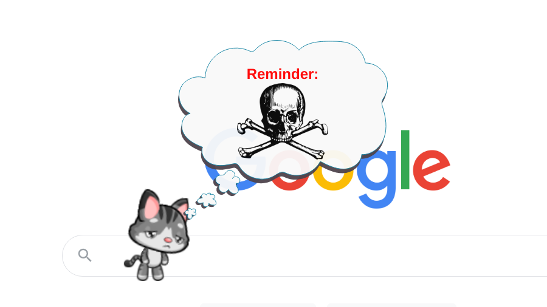

What’s the worst possible vulnerability a browser extension could possibly have? If the extension connects to a local application, [facilitating Remote Code Execution in that application](/2020/02/25/mcafee-webadvisor-from-xss-in-a-sandboxed-browser-extension-to-administrator-privileges/) would be pretty bad. But if it’s only the sandboxed browser extension, then granting attackers access to each and every website is probably as bad as it goes. The only way to top this should be making the access permanent, surviving even a browser restart.

Somehow the fun browser extension “Meow, The Cat Pet” ended up in that exact spot. Despite having merely 200 thousand users, it is promoted prominently in the “Fun” category of the Chrome Web Store. Yet up until recently it had a [Cross-Site Scripting](https://en.wikipedia.org/wiki/Cross-site_scripting) vulnerability. This vulnerability would have allowed any website to inject JavaScript code which would have executed in the context of websites visited by the user. A one-time visit to a malicious website would have been sufficient to compromise the browser integrity permanently.

{{}}
<em>
  Image credits:
  <a href="https://www.meowplayground.com/" rel="nofollow">Meow Playground</a>,
  <a href="https://openclipart.org/detail/307402/skull-and-crossbones" rel="nofollow">j4p4n</a>
</em>


Meow 1.10.5 was vulnerable, Meow 1.11.5 no longer is. Many thanks Alex Zhivotovsky for fixing this so quickly!



## The Cross-Site Scripting vulnerability

The purpose of the Meow extension is to display a cat (or a dog for those who prefer it) which will walk on your screen, occasionally doing some funny interactions like asking you for some fish. Similar extensions exist but usually they will limit their impact to the new tab page. Meow on the other hand shows up on every page you visit, meaning that its content is injected into each of those pages.

When extensions inject content into web pages, there are two potential issues. First is exposing critical controls to potentially malicious websites. That’s not really a problem here, nobody cares that a website can make your cat dance. But the other issue is introducing security vulnerabilities into websites that would have been secure otherwise. That’s for example a concern if the extension assigns to `innerHTML`: is the data being assigned safe?



In the image above, the talk bubble contents are being assigned via `innerHTML`. In most cases that HTML code is merely a static message. Some messages contain the pet’s or the owner’s name however. For example, one of the messages you’ll see is “Meow is here.” Here, “Meow” is the default pet name and can be changed into anything. What if we change it into `Meow`? Yes, the HTML code is being interpreted:



There are two complications to exploiting this vulnerability. First: pet and owner names are limited to 20 characters. That’s rather short for any real payload. However, this limitation is in the user interface only: if the value is set in `localStorage` directly any length will work. Which brings us to the second complication: why would any user set a malicious pet name?

## Remote extension configuration

Meow is not primarily a browser extension. It’s rather a web server called Meow Playground where people can play and chat together. The browser extension is merely an optional addition to that.

To make things more convenient, the two are linked: when you change your character on the server, it will change in the extension as well. This synchronization mechanism is implemented as a content script in the extension, limited to `https://www.meowplayground.com/game*`. It’s only a few lines of code:


window.postMessage({name:"sync-ready"}, "*");
window.addEventListener("message", function (event) {
  if (event.data == "page-ready"){
    ...
  } else {
    chrome.runtime.sendMessage(event.data, function(response) {
    });
  }
}, false);


So there is some special handling for the `page-ready` message, but otherwise any messages received from the game page are just forwarded to the extension’s background page. And some of these messages can change the extension’s configuration of course.

Does this mean that potential attackers have to compromise the game server in order to change extension settings to malicious values? No, it’s simpler than that. We have cross-document messaging via `window.postMessage()` here. Any website can send this message, which is why [in the documentation](https://developer.mozilla.org/en-US/docs/Web/API/Window/postMessage#security_concerns) it says:

> If you do expect to receive messages from other sites, **always verify the sender's identity** using the `origin` and possibly `source` properties. Any window (including, for example, `http://evil.example.com`) can send a message to any other window, and you have no guarantees that an unknown sender will not send malicious messages.

The code above does not have any checks for sender’s identity. So a malicious website could do something like the following:


var wnd = window.open("https://www.meowplayground.com/gamedummy", "_blank",
                      "width=100,height=100");
window.setTimeout(function()
{
  wnd.postMessage({
    method: "change-pet-name",
    data: {
      name: "Meow" +
            "                                           " +
            ""
    }
  }, "*");
  window.setTimeout(function()
  {
    wnd.close();
  }, 0);
}, 1000);


This opens a new browser window rather than using an invisible frame because the content script is only loaded into top-level documents. The window is closed after a second however, and nothing shows up in it (the address produces a 404 response), so users shouldn’t grow too concerned.

While the window is open, a message is sent to it. This message, if forwarded to the Meow extension, will change the pet’s name to a malicious value. The JavaScript code executing here merely shows a message with the page’s address, it would be easy to steal some data however without the user even noticing. The whitespace makes sure that the user doesn’t see anything suspicious on the settings page: all they see is “Meow,” the rest of the name is cut off. Now any time the pet talks and mentions its name the malicious code will run.

## Making things more reliable

It’s possible to send additional messages ensuring that this actually happens: make the pet visible and enable talking. Still, when and where this payload fires is very much a matter of luck. But Meow has one more feature: reminders.



The text of these reminders will show up in the talk bubble as well. Can HTML code be injected here as well? You bet! And can reminders also be added remotely? They sure can.


var wnd = window.open("https://www.meowplayground.com/gamedummy", "_blank",
                      "width=100,height=100");
window.setTimeout(function()
{
  wnd.postMessage({
    method: "reminder-add",
    data: {
      enabled: true,
      text: "",
      hours: 0,
      minutes: 1,
      id: "p0wned"
    }
  }, "*");
  window.setTimeout(function()
  {
    wnd.close();
  }, 0);
}, 1000);


This reminder will show up every minute, on every website the user happens to have open at the moment. And while this proof of concept is very noisy, real attackers certainly wouldn’t be showing any messages. In fact, it would be easy for them to hide the talk bubble itself so that the user doesn’t notice anything.

## The fix

Once I managed to reach the developer, a fix was implemented swiftly. Three out of four recommendations have been implemented on the same day which is an extraordinary good response:

1. The talk bubble no longer allows injecting HTML code.
2. The synchronization script checks message origin and rejects messages coming from other websites.
3. The messages allowed by the synchronization script have been restricted to things like “Change hat,” no longer allowing changing arbitrary settings.

The only recommendation not implemented at this point is isolating extension content in a frame. Unfortunately, this isn’t easy to implement here and might have undesirable side-effects.

## Timeline

* 2021-11-25: Reported vulnerability via email, no response
* 2021-12-02: Reached out via email again
* 2021-12-02: Reached out to the developer via Discord, received confirmation
* 2021-12-04: Meow 1.11.5 released with the fix (slight delay due to Chrome Web Store review)
